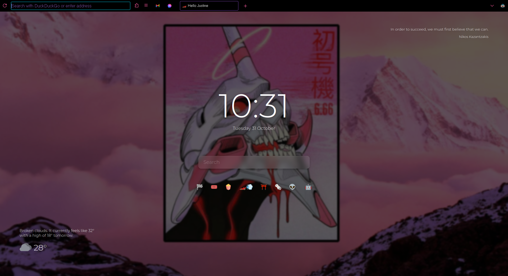

# Firefox Oneliner 🦊

## Features ✨

- **ONE LINE**: bro I mean its a one liner what more do you want?
- **Clean**: back/forward buttons keep hidden when disabled.
- **Flexible**: Support for compact, normal, and touch densities.

## What I used on my startpage 🛠️
 - I used **[Bonjurr](https://bonjourr.fr/)** extension for the startpage.
 - I used **[Firefox color](https://addons.mozilla.org/en-US/firefox/addon/firefox-color/)** for coloring the theme. you can hard code it but its easier to do it with this extension.
 - **[Wallpaper](https://wallpapercave.com/w/wp6693801)** used.
 - You can drag and drop things on the main bar when you `right click and customize tool bar`

## Installation 💾

1. In the searchbar 🔍, type **`about:config`**. A dialog will be shown to you. Press the **I accept the risk ✅** button.
2. Search 🔍 for **`toolkit.legacyUserProfileCustomizations.stylesheets`** and change it to **True** or just double click it.
3. Go to your Firefox profile:
   - In the address bar, type **`about:support`** and press **`Enter`**.
   - Search for **`Profile Directory`** and click on **`Open Directory`** button.
4. Create a folder and name it **`chrome`** (with lowercase).
5. Paste **`userChrome.css`** file into the folder or create one then copy paste the code.
6. Finaly **save the file 💾** then **Restart Firefox 🔁**

## Bonjurr Installation 💾
1. Install the [Bonjurr](https://bonjourr.fr/)
2. Press the gear (bottom right)
3. Scroll all the way down
4. Press import then use the file called **`bonjurr-settings.json`**

